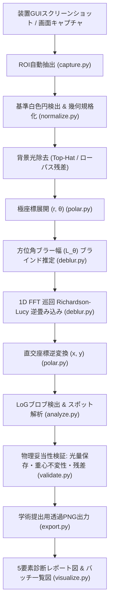

# AstroLaue (小型ラウエ画像復元パイプライン)

小型ラウエ回折装置（sLaue等）の露光走査によって生じる**円周方向（方位角方向）のモーションブラー**を、極座標変換と天体画像復元手法（Richardson-Lucy逆畳み込み等）によって補正・先鋭化し、回折斑点（Bragg spots）を高精度に検出・解析する画像処理パイプラインです。

学術研究・論文・報告書提出レベルの**「物理的妥当性検証 (光量保存・重心不変性・残差解析)」「学術提出用透過PNG出力」「多画像一括バッチ処理」**をサポートしています。

---

## 1. 背景と原理

小型ラウエ回折装置（パルステック工業 sLaue など）では、内蔵カメラ/検出器が円周方向に回転走査しながら露光を行うため、得られる回折斑点に**同心円弧状（方位角 $\theta$ 方向）の強いモーションブラー**が発生します。

本システムでは、天体画像復元（Astronomical Image Restoration）のアプローチを応用し、以下のステップで高精度なスポット復元を実現します：



### 特長
1. **画面全体の自動認識 & ROI切り出し:**
   GUIウィンドウのスクリーンショットから回折パターン領域（円盤＋中央ビームストッパー白丸）を全自動検出（ウィンドウの配置場所を問わず対応）。
2. **サブピクセル中心検出 & 幾何規格化:**
   画像モーメントと輪郭フィッティングにより、中央の白色円中心 $(x_c, y_c)$ をサブピクセル精度で求め、指定キャンバスサイズ（1024×1024等）の中心へアフィン変換。
3. **回転ブレを1次元並進ブレに帰着:**
   極座標系 $(r, \theta)$ へバイキュービック展開することで、円周方向の回転ブレを水平方向（$\theta$ 軸）の1次元ブレとしてモデル化。
   ※ 等角速度回転走査において、露光時間中の回転角度 $\Delta \theta$ は半径 $r$ によらず物理的に一定であるため、等角度サンプリングされた極座標系上の方位角ピクセル幅 $L_\theta$ は半径 $r$ に依存しない厳密な定数となり、1次元空間不変PSFの適用が数理的に正当化されます。
4. **FFT巡回 Richardson-Lucy 逆畳み込み:**
   $\theta=0$ と $\theta=2\pi$ の連続性（円周周期性）を数学的に満たすため、1次元FFTを用いた巡回畳み込みを適用。端部のアーティファクトをゼロにしつつ、ポアソンノイズ特性に適した非負値反復復元を高速実行。
5. **物理的・原理的妥当性の定量的検証:**
   - **光量保存性 (Flux Conservation):** 復元前後の主要スポット積分強度比 $\text{Flux Ratio} \approx 1.0$（誤差 $\le \pm 5\%$）を検証。
   - **重心不変性 (Bragg条件保持):** ブラー除去による回折斑点の重心座標シフトが許容値（$< 0.5\,\text{px}$）以下であることを検証。
   - **残差マップ (Residual Map):** 復元像のPSF再投影による二乗平均平方根誤差 (RMSE) を算出して過適合・偽像を評価。
6. **学術提出用透過PNG (RGBA):**
   ダイレクトビーム穴内部および外周円盤外部をアンチエイリアス透過（Alpha=0）処理し、学会・論文で直ちに使えるクリーンな画像を出力。
7. **一括バッチ処理:**
   指定ディレクトリ配下の全画像を探索し、画像ごとのパラメータを自動適応しながら一括処理し、`summary_report.csv` および一覧比較図 `batch_summary_plot.png` を生成。

---

## 2. ディレクトリ構成

```text
AstroLaue/
├── astrolaue/
│   ├── __init__.py
│   ├── capture.py        # GUIキャプチャ / ROI自動切り出し
│   ├── normalize.py      # 中心検出 / 背景光除去 / 幾何規格化
│   ├── polar.py          # 直交 ⇔ 極座標 相互変換 (バイキュービック補間)
│   ├── deblur.py         # PSF生成 / ブラー幅ブラインド推定 / 巡回 Richardson-Lucy
│   ├── analyze.py        # LoGスポット検出 / FWHM・強度解析
│   ├── validate.py       # 物理妥当性検証 (光量保存・重心不変性・残差解析)
│   ├── export.py         # 学術提出用透過PNG (RGBA / 16-bit / 反転表示) 出力
│   ├── visualize.py      # 5要素診断プロット & バッチ一覧図
│   ├── pipeline.py       # パイプラインオーケストレーター
│   └── main.py           # CLIメインモジュール
├── tests/
│   ├── test_synthetic.py # 模擬ラウエ像生成と復元精度の単体テスト
│   ├── test_pipeline.py  # 全体パイプラインの結合テスト
│   └── test_validation.py# 物理妥当性・透過PNG・バッチ処理の統合テスト
├── main.py               # ルート実行スクリプト
├── requirements.txt      # 依存パッケージ一覧
├── pyproject.toml        # パッケージメタデータ
└── README.md
```

---

## 3. インストール方法

Python 3.9 以上に対応しています。

```bash
# 依存関係のインストール
pip install -r requirements.txt

# または編集可能モードでインストール
pip install -e .
```

---

## 4. 簡単起動ガイド (Windows & Linux)

コマンドライン引数を覚えることなく、**ダブルクリック**または**ワンアクション**で直感的に起動できます。

### 🪟 Windows の場合
- **常駐ホットキー監視モード (`run_resident.bat`) ★おすすめ:**
  - **ダブルクリックで常駐開始:** 測定ごとに毎回バッチを起動する手間をなくします。
  - バックグラウンドで待機し、キーボードの **`[F9]`** （または **`[Ctrl + Shift + L]`**）を押すだけで、現在画面上に表示されている回折像を瞬時にキャプチャ＆復元します。
  - 完了時にチャイム音で通知し、最新結果を `results_live/` に保存すると同時に、連続測定用に `results_live/history/` へタイムスタンプ付きで自動蓄積します。
  - 特定のアプリ名に縛られないため、測定ソフト（sLaue等）はもちろん、**「過去の測定画像を開いた画像ビューア」**や別ソフトの画面でもそのまま補正可能です。
- **メインランチャー (`run.bat`):**
  - **ダブルクリック:** 対話メニューが起動し、番号（1: 単一画像, 2: バッチ一括, 3: ライブキャプチャ, 4: 常駐ホットキー監視, 5: テスト）を選ぶだけで実行可能。
  - **ドラッグ＆ドロップ:** 画像ファイル（またはフォルダ）を `run.bat` のアイコンにドラッグ＆ドロップするだけで、即座に復元・解析が実行され、結果フォルダがエクスプローラーで開きます。
- **全画像一括バッチ (`run_batch.bat`):**
  - ダブルクリックするだけで、`share` 内の全画像を一括復元し、一覧比較図とサマリーCSVを生成して結果フォルダを開きます。
- **画面キャプチャ単発実行 (`run_live.bat`):**
  - ダブルクリックするだけで、現在の手前ウィンドウまたは画面全体から回折像を1回自動認識・復元して結果フォルダを開きます。

### 🐧 Linux の場合
- **常駐ホットキー監視モード (`run_resident.sh`):**
  ```bash
  bash run_resident.sh
  # [Enter]キーを押すたびに画面キャプチャ＆復元を実行、[Q]で終了
  ```
- **対話ランチャー / 引数実行 (`run.sh` または `python launcher.py`):**
  ```bash
  # 対話メニュー起動
  bash run.sh
  # または
  python launcher.py

  # 特定画像の一発復元
  bash run.sh share/画像260925.png
  ```
- **全画像一括バッチ (`run_batch.sh`):**
  ```bash
  bash run_batch.sh
  ```
- **画面キャプチャ単発実行 (`run_live.sh`):**
  ```bash
  bash run_live.sh
  ```

---

## 5. 高度な使用方法 (CLI オプション)

#### 1. 常駐ホットキー監視モード (連続測定・画像ビューア対応)
```bash
python main.py --watch --output ./results_live/ --show-diagnostic --export-transparent
```

#### 2. 単一画像の復元・解析
```bash
python main.py --input share/画像260925.png --output ./results/ --iter 25 --show-diagnostic --export-transparent --validate-physics
```

#### 3. ディレクトリ内全画像の一括バッチ処理
```bash
python main.py --batch-dir /share --output ./results_batch/ --export-transparent --validate-physics
```

#### 実行オプション一覧

| オプション | デフォルト値 | 説明 |
| :--- | :--- | :--- |
| `--watch`, `--resident` | `False` | **常駐ホットキー監視モード** (F9 または Ctrl+Shift+L でいつでも即時キャプチャ＆復元) |
| `--live` | `False` | ライブ画面キャプチャ単発実行モード (手前ウィンドウまたは画面全体から1回取得) |
| `--target-mode` | `auto` | キャプチャ対象 (`auto`: 手前ウィンドウ優先, `screen`: 画面全体, `active`: アクティブウィンドウ) |
| `--window-title` | `None` (不問) | 特定ウィンドウ名を指定する場合のみ指定 (省略時は特定アプリに依存せず画面から取得) |
| `--monitor` | `1` | キャプチャ対象モニタ番号 (`1`: プライマリ, `0`: 全マルチディスプレイ) |
| `--input`, `-i` | `None` (自動探索) | 単一入力画像パス (PNG/JPG等) |
| `--batch-dir` | `None` | 一括処理対象の画像ディレクトリパス (例: `/share` または `share/`) |
| `--output`, `-o` | `./results` | 出力ディレクトリ |
| `--iter` | `25` | Richardson-Lucy逆畳み込みの反復回数 |
| `--blur-len`, `-b`| `None` (自動推定) | 方位角ブラー長 (ピクセル単位)。省略時は自己相関・プロファイルから自動推定 |
| `--kernel-type` | `rect` | PSFカーネル形状 (`rect`: 等速走査, `gaussian`: ガウス分布, `trapezoid`: 加減速台形) |
| `--method` | `rl` | 復元手法 (`rl`: Richardson-Lucy, `wiener`: Wienerフィルタ) |
| `--damping` | `0.0` | Richardson-Lucyのダンピング係数 (ノイズ増幅抑制) |
| `--nsr` | `0.01` | Wienerフィルタ使用時のノイズ対信号比 (NSR) |
| `--output-size` | `1024` | 幾何規格化キャンバスのサイズ (N×N ピクセル) |
| `--show-diagnostic` | `True` | 5要素診断レポート図 (PNG) を出力 |
| `--export-transparent` | `True` | 学術提出用透過PNG (RGBA, `restored_transparent.png`) を出力 |
| `--validate-physics` | `True` | 物理妥当性検証 (光量保存・重心ズレ・残差) を実行 |

---

## 5. 出力成果物

### バッチ処理時 (`./results_batch/`)
- **`summary_report.csv`**: 全画像の解析結果サマリー表
- **`batch_summary_plot.png`**: 全画像の「元画像」「復元直交画像」「FWHMプロファイル」をまとめた一覧比較図
- **各画像ごとのサブディレクトリ (`results_batch/<画像名>/`)**:
  - `restored_transparent.png`: 透過PNG (RGBA, 通常表示)
  - `restored_transparent_inverted.png`: 透過PNG (白背景・黒スポット, X線回折標準反転)
  - `restored_transparent_16bit.png`: 16-bit高ダイナミックレンジ透過PNG
  - `diagnostic_report.png`: 5要素診断レポート図 (物理検証指標付き)
  - `detected_spots.csv`: 各回折スポットの座標、強度、FWHM詳細
  - `residual_polar.png`: 極座標残差マップ

---

## 6. テストの実行

単体テスト、物理妥当性テスト、バッチ処理テストを実行します：

```bash
pytest -v
```
