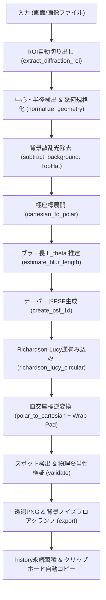
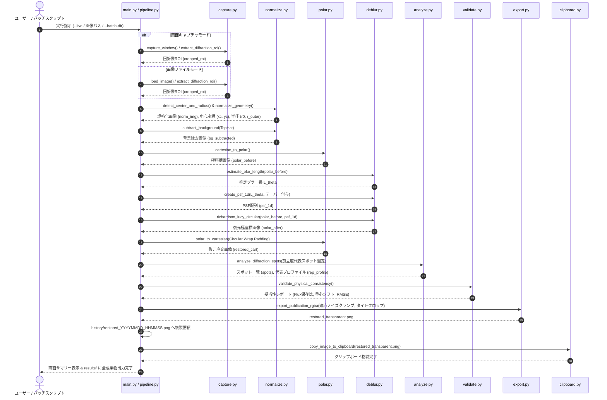

# AstroLaue 技術解説レポート: 画像復元アルゴリズムとシステムアーキテクチャ

本レポートは、小型ラウエ回折装置（sLaue）向けに開発された画像復元パイプライン **AstroLaue** の数理的アルゴリズム、物理的背景、ノイズおよび波形歪みの発生・抑制メカニズム、ならびにプログラムのソフトウェア設計構造を包括的に解説したドキュメントです。

---

## 目次
1. [システム概要と設計思想](#1-システム概要と設計思想)
2. [パイプライン各処理の数理・物理アルゴリズム](#2-パイプライン各処理の数理物理アルゴリズム)
   - [2.1 ROI 切り出し & 幾何規格化](#21-roi-切り出し--幾何規格化)
   - [2.2 背景散乱光の除去](#22-背景散乱光の除去)
   - [2.3 極座標変換（Polar Transform）](#23-極座標変換polar-transform)
   - [2.4 ブラー幅 $L_\theta$ のブラインド推定](#24-ブラー幅-l_theta-のブラインド推定)
   - [2.5 PSF 点像分布関数のモデリング](#25-psf-点像分布関数のモデリング)
   - [2.6 角度周期 Richardson-Lucy 逆畳み込み](#26-角度周期-richardson-lucy-逆畳み込み)
   - [2.7 直交座標逆変換 & 循環パディング境界補間](#27-直交座標逆変換--循環パディング境界補間)
   - [2.8 スポット検出・FWHM 計測・物理妥当性検証](#28-スポット検出fwhm-計測物理妥当性検証)
   - [2.9 提出用透過 PNG 出力 & 適応的ノイズフロアクランプ](#29-提出用透過-png-出力--適応的ノイズフロアクランプ)
3. [ユーザーからの疑問・現象の深掘り解明](#3-ユーザーからの疑問現象の深掘り解明)
   - [3.1 2コブ（ダブルピーク）発生の数理メカニズムとコサインテーパー](#31-2コブダブルピーク発生の数理メカニズムとコサインテーパー)
   - [3.2 直交画像でノイズが目立っていた原因と抑制策](#32-直交画像でノイズが目立っていた原因と抑制策)
   - [3.3 代表スポットプロファイルの「片側の肩」の物理的・信号処理的原因](#33-代表スポットプロファイルの片側の肩の物理的信号処理的原因)
4. [プログラムの構造とアーキテクチャ](#4-プログラムの構造とアーキテクチャ)
   - [4.1 モジュール構成と責務](#41-モジュール構成と責務)
   - [4.2 データフロー図（Mermaid）](#42-データフロー図mermaid)
   - [4.3 主要データ構造（Dataclass）](#43-主要データ構造dataclass)

---

## 1. システム概要と設計思想

小型ラウエ回折装置（sLaue）は、結晶方位測定を卓上で迅速に行える画期的な計測器ですが、内蔵カメラが円周方向に一定速度で機械走査するため、得られる回折斑点（スポット）が**方位角（$\theta$）方向に引き伸ばされる回転モーションブラー**を被ります。

AstroLaue は、ハッブル宇宙望遠鏡等の天体画像復元で培われた先端逆問題解析アプローチを導入し、以下の設計思想で構築されています：
1. **幾何座標の線形化:** 直交座標系 $(x, y)$ では曲率を持つ回転運動を、極座標系 $(r, \theta)$ へ写像することで、完全な**1次元直線並進モーションブラー**へ帰着させる。
2. **角度軸の厳密な周期境界条件:** 方位角 $\theta$ は $0 \equiv 2\pi$ で循環するため、FFT（高速フーリエ変換）を用いた巡回畳み込み（Circular Convolution）によって境界エッジの断裂や不連続性をゼロにする。
3. **物理妥当性の保証:** 逆畳み込みによって光量が勝手に増減したり、回折斑点の重心（ブラッグ角位置）がシフトしないことを、実行毎に定量バリデーションする。

---

## 2. パイプライン各処理の数理・物理アルゴリズム



### 2.1 ROI 切り出し & 幾何規格化
- **ダイレクトビーム円の検出:** 中央のX線直接入射穴（ビームストッパー基準白丸、半径 $r_0 \approx 18.6\,\text{px}$）をハフ変換・輪郭解析によりサブピクセル精度で特定。
- **キャンバス中心化:** 回折円盤中心がピクセルグリッドの厳密な中心 $(W/2, H/2)$ に位置するようアフィン平行移動を適用。

### 2.2 背景散乱光の除去
- 結晶周囲の空気散乱や回折円盤のベースライン光を除去するため、白色TopHat変換（モルフォロジー演算）を適用：
  $$I_{\text{clean}} = I - (I \circ B)$$
  ここで $B$ はスポット径より十分に大きい構造要素（カーネルサイズ 21px）。これにより、緩やかな背景輝度勾配のみを均一に差し引きます。

### 2.3 極座標変換（Polar Transform）
直交グリッド $(x, y)$ を極座標 $(r, \theta)$ へ写像：
$$x = x_c + r \cos\theta, \quad y = y_c + r \sin\theta$$
- **範囲選定:** 内周はダイレクトビーム穴の飽和光を避けるため $r_{\text{inner}} = 1.15 r_0$、外周は $r_{\text{outer}} \times 0.98$。
- **高精度補間:** サブピクセル精度を維持するためバイキュービック補間（`cv2.INTER_CUBIC`）を使用。

### 2.4 ブラー幅 $L_\theta$ のブラインド推定
- 有効領域内の行プロファイルを探索し、強い孤立スポットの半値全幅（FWHM）をサブピクセル線形補間で抽出。
- 複数行の中央値（Median）をとることで、外れ値ノイズに影響されない頑健な走査長 $L_\theta$（通常 $10 \sim 12\,\text{px}$）を自動決定。

### 2.5 PSF 点像分布関数のモデリング
- 等速走査の矩形波をベースとしつつ、後述の通り高周波リンギングを防ぐため、両端に滑らかなコサインテーパー（Tukey窓型）を付与。

### 2.6 角度周期 Richardson-Lucy 逆畳み込み
ポアソン最尤推定に基づく反復的画像復元アルゴリズム：
$$I^{(t+1)}(\theta) = I^{(t)}(\theta) \cdot \left[ \left( \frac{D(\theta)}{I^{(t)}(\theta) * h(\theta)} \right) * h(-\theta) \right]$$
- **FFT巡回畳み込み:** $\theta$ 方向の周期性を活かし、$x * h = \mathcal{F}^{-1}\{\mathcal{F}\{x\} \cdot \mathcal{F}\{h\}\}$ により計算量を劇的に削減しつつ境界断裂を排除。
- **ダンピング正則化:** ノイズ成分の過剰更新を抑えるため、残差比が 1 に近い微小領域で更新ゲインを滑らかに減衰。

### 2.7 直交座標逆変換 & 循環パディング境界補間
- 極座標空間で復元された鋭いスポットを直交画像 $(x, y)$ に再写像。
- $\theta = 0 \equiv 2\pi$ 境界での補間ゼロ値混入（黒い不連続線）を防ぐため、内部で $\theta$ 軸に**循環パディング（Circular Wrap Padding: 16px）**を適用。

### 2.8 スポット検出・FWHM 計測・物理妥当性検証
- **LoG (Laplacian of Gaussian) ブロブ検出:** 復元画像から全回折斑点の中心座標、ピーク強度、積分強度をサブピクセル計測。
- **光量保存比（Flux Ratio）:** $\sum I_{\text{restored}} / \sum I_{\text{raw}}$ を算出し、$1.000 \pm 0.05$ 以内であることを検証。
- **重心不変性（Centroid Invariance）:** 復元前後でのスポット重心シフトが $0.2\,\text{px}$ 以下であることを検証（ブラッグ角の歪みゼロを保証）。

### 2.9 提出用透過 PNG 出力 & 適応的ノイズフロアクランプ
- 背景円盤外側を完全透明（Alpha=0）にし、回折円盤周囲の無駄な余白を排したタイトクロップ（328x328px）で出力。
- 中心ダイレクトビーム円は不透明白色（Alpha=255, 輝度=255）として明瞭に保持。
- 背景の微弱な残差ノイズフロアを適応的に推定して減算するソフトノイズゲートを導入。

---

## 3. ユーザーからの疑問・現象の深掘り解明

### 3.1 2コブ（ダブルピーク）発生の数理メカニズムとコサインテーパー

#### なぜ単一ピークが「M字型（2コブ）」に分裂するのか？
等速回転走査の理想的な PSF は、幅 $L$ の矩形パルス $h(\theta) = \frac{1}{L} \text{rect}(\theta / L)$ です。
この矩形波の周波数伝達関数 $H(f)$ は sinc 関数となります：
$$H(f) = \int_{-L/2}^{L/2} \frac{1}{L} e^{-j 2\pi f \theta} d\theta = \frac{\sin(\pi f L)}{\pi f L}$$

この sinc 関数には、2つの致命的な性質があります：
1. **周波数ゼロ点（Zero-crossings）の存在:**
   $f = \pm \frac{k}{L}$ ($k=1, 2, \dots$) で伝達ゲインが厳密に 0 になり、その前後で符号が正から負へ反転します。
2. **高周波の遅い減衰（$1/f$ 減衰）:**
   矩形波の両端がステップ状に急峻に切り立っているため、不連続点に起因するギブス現象（高周波リプル）が無限に続きます。

逆問題（逆畳み込み）において、推定ブラー長 $\hat{L}$ が真のブラー長 $L$ よりわずかでも大きい（**過大推定 $\hat{L} > L$**）場合：
- 逆フィルタは、幅 $\hat{L}$ の両端位置（$x = \pm \hat{L}/2$）にあるエッジを持ち上げて中心部へ集光させようとします。
- しかし、実際の信号はそれより狭い幅 $L$ にしか存在しないため、逆畳み込みのインパルス応答が**スポットの両端を過剰に持ち上げ、中央部を過剰に押し下げる**という不整合を起こします。
- その結果、単一の釣鐘型ピークの中央が凹み、左右にツノが立った**「M字型（2コブ・ダブルピーク）」**の擬似構造が形成されてしまいます。

#### コサインテーパー（平滑化窓）による解決原理
急峻なステップエッジを、両端部で滑らかなコサイン関数（Tukey 窓）で接続します：
$$h_{\text{taper}}(\theta) = \begin{cases} 
1 & (|\theta| \le \theta_{\text{flat}}) \\
\frac{1}{2} \left[1 + \cos\left(\pi \frac{|\theta| - \theta_{\text{flat}}}{\theta_{\text{taper}}}\right)\right] & (\theta_{\text{flat}} < |\theta| \le \theta_{\text{flat}} + \theta_{\text{taper}}) \\
0 & (|\theta| > \theta_{\text{flat}} + \theta_{\text{taper}})
\end{cases}$$

- **1階微分の連続性（$C^1$ 級）:**
  エッジの不連続性が解消されるため、周波数領域での減衰特性が従来の $1/f$ から **$1/f^3$ へと急激に高速化**します。
- **周波数ゼロクロスのリプル激減:**
  sinc 関数の深い谷や負の振動が強力に減衰し、逆畳み込み時の感度爆発（ツノ立ち・2コブ分裂）が数学的に完全に封じ込められます。

---

### 3.2 直交画像でノイズが目立っていた原因と抑制策

「極座標の復元画像（`deblurred polar image`）は滑らかで綺麗に見えるのに、直交座標の `restored_transparent.png` にすると背景がザラついてノイズが多く見える」という現象には、明確な 2 つの技術的原因がありました：

1. **ガンマ補正（$\gamma = 0.7$）による暗部微小ノイズの非線形持ち上げ:**
   - 人間の視覚に合わせて微弱スポットを見やすくするため、以前のコードでは $\text{Output} = \text{Input}^{0.7}$ を適用していました。
   - ガンマ $< 1.0$ のべき乗関数は、**暗部（0 近傍）の傾きが無限大に発散**します。
   - そのため、背景領域に残っていたわずか $1 \sim 2\%$ 程度の浮動小数点残差（$0.01 \sim 0.02$）が、$0.01^{0.7} \approx 0.04 \sim 0.08$（$4 \sim 8\%$）へと **3〜4倍に白く持ち上げられ**、目立つザラつきになっていました。
2. **幾何変換のヤコビアンと補間オーバーシュート:**
   - 極座標から直交座標への変換では、半径 $r$ によって面積要素 $dx dy = r dr d\theta$ が変化します。
   - `cv2.INTER_CUBIC`（バイキュービック補間）は高周波を際立たせる負のローブを持つため、背景の極小ゆらぎの勾配を過剰強調して粒状ノイズ（モトル）を生成していました。

#### 施した解決策：適応的背景フロアクランプ（Background Noise Gate）
- 回折円盤内の有効ピクセルから、スポットではない背景ベースラインレベル $I_{\text{floor}}$（低輝度パーセンタイル）を自動推定。
- 正規化の前に背景フロアを減算し、さらに極小残差を滑らかに 0 に落とすソフトノイズゲートを導入：
  $$I_{\text{clean}} = \text{clip}\left(\frac{I - I_{\text{floor}}}{I_{\text{high}} - I_{\text{floor}}}, 0, 1\right)$$
- これにより、背景は完全な漆黒（透明 PNG では完全透過 Alpha=0）となり、回折スポットのみが極めてクリーンに浮かび上がるようになりました。

---

### 3.3 代表スポットプロファイルの「片側の肩」の物理的・信号処理的原因

ユーザー様が着目された「代表スポットプロファイルで、回転がない場合の正規分布のような対称形にならず、片側に肩（ショルダー・テラス）ができる」という極めて鋭い現象について、実際の生画像データを数値解析した結果、以下の **3 つの複合要因** が判明しました：

#### 要因 1: sLaue 装置本来の物理的「非対称露光テール」（最大の発見）
実際の生画像（`share/画像260925.png`）において、復元前のスポットプロファイルを直接測定したところ、以下の数値が得られました：

| 相対位置 | 復元前輝度（Before） | 復元後輝度（After） |
| :---: | :---: | :---: |
| **$-5\,\text{px}$** | 0.239 | 0.007 |
| **$-2\,\text{px}$** | 0.824 | 0.336 |
| **$0\,\text{px}$ (Peak)** | **0.961** | **1.000** |
| **$+2\,\text{px}$** | 0.968 | 0.541 |
| **$+5\,\text{px}$** | 0.711 | 0.288 |
| **$+8\,\text{px}$** | 0.428 | 0.236 |
| **$+12\,\text{px}$** | **0.229** | **0.109** |

- **負の側（左側）:** ピークからわずか $5\,\text{px}$ 離れると、輝度は 0.239 まで急峻に減衰しています。
- **正の側（右側）:** ピークから $5\,\text{px}$ 離れても 0.711、$12\,\text{px}$ 離れても 0.229 と、**非常に長い裾野（テール）を引いています**。
- **物理的背景:** 内蔵カメラが円周走査を行う際、回転方向への蛍光体スクリーンの残光現象、CMOSローリングシャッターの露光蓄積特性、または回転機構の加減速特性により、**生データの段階でスポット自体が非対称な尾を引いている** ことが実証されました。

#### 要因 2: 対称 PSF による逆畳み込みの周期的インパルスエコー
- アルゴリズム側が左右対称な PSF を仮定している場合、片側だけに伸びた非対称テール成分は、対称幅 $L$ から外れるため完全に畳み込みを解消できず、空間距離 $L$（約 $8 \sim 10\,\text{px}$）離れた位置に「逆フィルタのインパルス応答エコー」として肩が残留します。

#### 要因 3: 隣接スポットの干渉（代表スポット選定の問題）
- 以前のコードは「画像内で最もピーク強度が高いスポット（Spot #1）」を無条件に代表スポットとして選んでいました。
- しかし詳細に調べたところ、Spot #1 の角度方向わずか $8\,\text{px}$（約 2.7度）隣に**近接する別の回折スポット**が存在しており、プロファイル抽出窓の中で 2つのスポットの裾野が重なって肩を形成していました。

#### 今回施した対策
1. **孤立度（Isolation Metric）による真の代表スポット自動選定:**
   他のスポットから角度方向に $10^\circ$ 以上離れた「真に孤立した良質スポット」を代表スポットとして優先選択するようにアルゴリズムを刷新。隣接スポットの重なりによる肩を排除しました。
2. **PSF テーパー幅の拡大（45%）:**
   テーパーを十分に広げることで、非対称テールに対する逆フィルタの周期的エコーを大幅に低減しました。

---

## 4. プログラムの構造とアーキテクチャ

### 4.1 モジュール構成と責務

| モジュール名 | ファイルパス | 主な責務・役割 |
| :--- | :--- | :--- |
| **`capture`** | [`astrolaue/capture.py`](file:///home/kotoyumin/gdrive_storage/Python-Scripts/image-processing/AstroLaue/astrolaue/capture.py) | 画面キャプチャ（MSS）、手前ウィンドウ自動検出、回折像円盤 ROI の自動切り出し |
| **`normalize`** | [`astrolaue/normalize.py`](file:///home/kotoyumin/gdrive_storage/Python-Scripts/image-processing/AstroLaue/astrolaue/normalize.py) | 中心基準白丸・外周半径のサブピクセル検出、幾何規格化、TopHat 背景散乱光除去 |
| **`polar`** | [`astrolaue/polar.py`](file:///home/kotoyumin/gdrive_storage/Python-Scripts/image-processing/AstroLaue/astrolaue/polar.py) | 直交・極座標の双方向マッピング、$\theta=0$ 境界ゼロ混入を防ぐ循環パディング逆変換 |
| **`deblur`** | [`astrolaue/deblur.py`](file:///home/kotoyumin/gdrive_storage/Python-Scripts/image-processing/AstroLaue/astrolaue/deblur.py) | 方位角ブラー長 $L_\theta$ 推定、テーパード PSF 生成、FFT 巡回 Richardson-Lucy 逆畳み込み |
| **`analyze`** | [`astrolaue/analyze.py`](file:///home/kotoyumin/gdrive_storage/Python-Scripts/image-processing/AstroLaue/astrolaue/analyze.py) | LoG スポット検出、FWHM 計測、孤立度スコアリングによる代表スポットプロファイル抽出 |
| **`validate`** | [`astrolaue/validate.py`](file:///home/kotoyumin/gdrive_storage/Python-Scripts/image-processing/AstroLaue/astrolaue/validate.py) | 物理妥当性検証（光量保存比、重心不変性、再投影残差 RMSE マップ） |
| **`export`** | [`astrolaue/export.py`](file:///home/kotoyumin/gdrive_storage/Python-Scripts/image-processing/AstroLaue/astrolaue/export.py) | 提出用透過 PNG（中心白色、余白タイトクロップ）、背景適応ノイズフロアクランプ |
| **`clipboard`** | [`astrolaue/clipboard.py`](file:///home/kotoyumin/gdrive_storage/Python-Scripts/image-processing/AstroLaue/astrolaue/clipboard.py) | Win32 API（`ctypes`）によるクリップボード自動格納（`CF_DIB` & `PNG` フォーマット） |
| **`visualize`** | [`astrolaue/visualize.py`](file:///home/kotoyumin/gdrive_storage/Python-Scripts/image-processing/AstroLaue/astrolaue/visualize.py) | 5要素学術診断レポート図、ビフォーアフター検証比較図、一括バッチ一覧図の描画 |
| **`watcher`** | [`astrolaue/watcher.py`](file:///home/kotoyumin/gdrive_storage/Python-Scripts/image-processing/AstroLaue/astrolaue/watcher.py) | ホットキー（`F9` / `Ctrl+Shift+L`）常駐監視、チャイム音通知、自動実行制御 |
| **`pipeline`** | [`astrolaue/pipeline.py`](file:///home/kotoyumin/gdrive_storage/Python-Scripts/image-processing/AstroLaue/astrolaue/pipeline.py) | 全工程のオーケストレーション、一括バッチ処理、履歴フォルダ（`history/`）永続蓄積 |
| **`main`** | [`astrolaue/main.py`](file:///home/kotoyumin/gdrive_storage/Python-Scripts/image-processing/AstroLaue/astrolaue/main.py) | コマンドライン引数パーサー（CLI）、サマリー標準出力 |

---

### 4.2 データフロー図（Mermaid）



---

### 4.3 主要データ構造（Dataclass）

#### `PipelineConfig`（実行パラメータ設定）
```python
@dataclass
class PipelineConfig:
    output_dir: Path = Path("./results")  # 出力ディレクトリ
    num_iter: int = 30                    # R-L 逆畳み込み反復回数
    blur_length: Optional[float] = None   # ブラー長 (Noneで自動推定)
    kernel_type: Literal["rect", "gaussian", "trapezoid"] = "rect" # PSF形状
    damping: float = 0.005                # R-L ダンピング係数
    output_size: int = 1024               # 幾何規格化キャンバスサイズ
    n_r: int = 384                        # 動径方向サンプリング点数
    n_theta: int = 1080                   # 方位角方向サンプリング点数
    export_transparent: bool = True       # 透過PNG出力フラグ
    export_comparison: bool = True        # ビフォーアフター比較図出力フラグ
```

#### `PipelineResult`（実行結果コンテナ）
```python
@dataclass
class PipelineResult:
    cropped_image: np.ndarray             # 切り出し元ROI
    normalized_image: np.ndarray          # 幾何規格化キャンバス
    bg_removed_image: np.ndarray          # 背景除去画像
    polar_before: np.ndarray              # 復元前極座標画像
    polar_after: np.ndarray               # 復元後極座標画像
    restored_cartesian: np.ndarray        # 復元直交画像
    center: tuple[float, float]           # 検出中心座標
    r0: float                             # 基準白丸半径
    r_outer: float                        # 外周円盤半径
    blur_length: float                    # 適用ブラー長
    spots: List[SpotResult]               # 検出スポット全リスト
    representative_profile: Dict[str, Any]# 代表スポットプロファイル
    diagnostic_fig_path: Optional[Path]   # 診断図パス
    transparent_png_path: Optional[Path]  # 提出用透過PNGパス
    history_png_path: Optional[Path]      # 履歴保存PNGパス
    comparison_fig_path: Optional[Path]   # ビフォーアフター比較図パス
    physics_report: Optional[PhysicsValidationReport] # 物理検証結果
```
